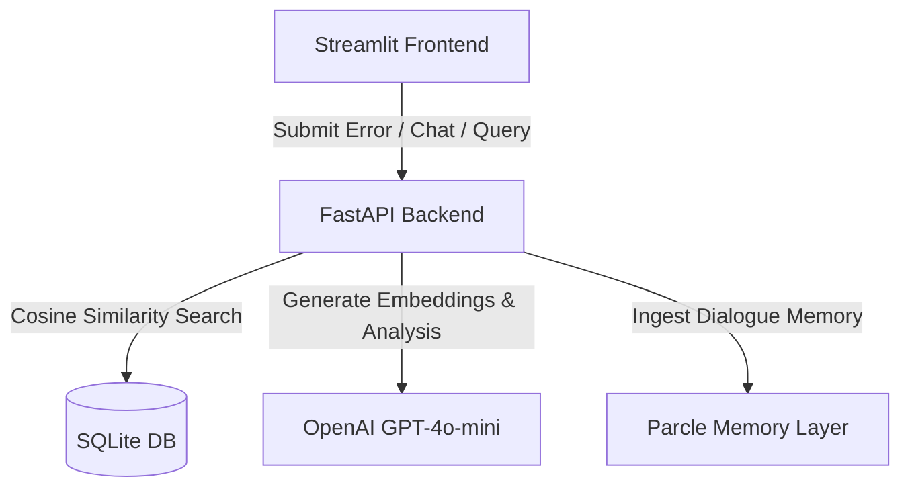

# Project Profile: Zero-Sync Debugger (Sentinel AI)

Zero-Sync Debugger is an AI-powered long-term memory system designed for developers. It records software errors and stack traces, provides automated root cause analyses and solution scripts, and semantically remembers them to avoid resolving the same issues twice.

---

## 🏗️ System Architecture & Workflow

The system is built as a two-tier Python application consisting of a **FastAPI backend** and a **Streamlit frontend**, integrating **OpenAI API** for intelligence and **Parcle API** for long-term memory ingestion.

### Flow of Execution (Submit Error)
1. **Submission**: The user enters an error message (stack trace) and optionally uploads log files and project information via the frontend.
2. **Semantic Cache Search**: The backend calls the OpenAI Embedding API to vectorize the new error signature. It compares this vector using cosine similarity (dot product) against all historical bugs stored in the SQLite database.
3. **Instant Recall (Confidence >= 85%)**: If a highly similar bug exists (similarity score $\ge 0.85$), the system immediately returns the cached solution, root cause, and code snippets, bypassing new AI generation.
4. **AI Generation (Confidence < 85%)**: If it is a new error, the system prompts OpenAI `gpt-4o-mini` to perform a comprehensive root cause analysis and generate step-by-step solutions, prevention tips, terminal commands, code changes, and dependency fixes.
5. **Dual Ingestion**:
   - The analysis and its embedding vector are saved in the local **SQLite database**.
   - The error and its solution are ingested into the **Parcle Memory API** as dialog memory, preserving long-term conversational context isolated by project namespace.

---

## 📂 File Structure & Codebase Overview

- **`backend/`**
  - [main.py](file:///c:/Users/sonav/OneDrive/Projects/Sentinel%20AI/backend/main.py): Sets up the FastAPI application, CORS middleware, databases, and routes.
- **`api/`**
  - [routes.py](file:///c:/Users/sonav/OneDrive/Projects/Sentinel%20AI/api/routes.py): Main endpoint controller logic (error submission, similarity search, history log, chat room).
- **`database/`**
  - [db.py](file:///c:/Users/sonav/OneDrive/Projects/Sentinel%20AI/database/db.py): Configures SQLAlchemy, local SQLite engine setup, and DB session provider.
- **`models/`**
  - [bug.py](file:///c:/Users/sonav/OneDrive/Projects/Sentinel%20AI/models/bug.py): Defines the `Bug` SQLAlchemy model and Pydantic schemas for request/response serialization.
- **`services/`**
  - [ai_service.py](file:///c:/Users/sonav/OneDrive/Projects/Sentinel%20AI/services/ai_service.py): Handles OpenAI completions, embedding vector calculations, and mock fallback routines.
  - [search_service.py](file:///c:/Users/sonav/OneDrive/Projects/Sentinel%20AI/services/search_service.py): Implements cosine similarity search over vector embeddings.
- **`memory/`**
  - [parcle_service.py](file:///c:/Users/sonav/OneDrive/Projects/Sentinel%20AI/memory/parcle_service.py): Connects to the Parcle Python client library for ingesting and querying dialog memory.
- **`frontend/`**
  - [app.py](file:///c:/Users/sonav/OneDrive/Projects/Sentinel%20AI/frontend/app.py): Premium Streamlit dashboard using dark mode styling, custom font loading, and modular views.

---

## 🛢️ Database Schema & Storage Model

The database stores the details inside a single `bugs` table. Since SQLite has limited custom types, we store complex structured AI data inside existing standard columns:

### **`bugs` Table (SQLite)**
| Column | Type | Description |
| :--- | :--- | :--- |
| **`id`** | `Integer (PK)` | Unique index identifier. |
| **`project_name`** | `String` | Project tag used for grouping and filtering. |
| **`error_message`** | `Text` | Raw error logs or stack trace headers. |
| **`root_cause`** | `Text` | Contextual analysis of why the bug occurred. |
| **`solution`** | `Text` | **Serialized JSON String** containing the structured solution fields (`solution`, `prevention_tips`, `suggested_commands`, `suggested_code_changes`, `suggested_dependency_fixes`). |
| **`embedding`** | `Text` | Serialized float array representing the 1536-dimensional OpenAI vector. |
| **`timestamp`** | `DateTime` | Auto-recorded date and time of ingestion. |

---

## 🔌 API Endpoints Breakdown

The FastAPI backend exposes the following endpoints:

### 1. `GET /`
- **Purpose**: Health check endpoint.
- **Response**: Confirmation of online status and tagline.

### 2. `POST /submit_error`
- **Request Body**: `BugSubmitRequest` (error message, description, project name, log file content).
- **Behavior**: Runs similarity search. If matching score $\ge 0.85$, returns cached analysis. Otherwise, generates analysis via OpenAI, stores in SQLite database, embeds it, ingests it into Parcle, and returns it.
- **Response**: `BugAnalysisResponse`.

### 3. `POST /analyze_error`
- **Purpose**: Bypasses the similarity cache to force a fresh OpenAI analysis. Saves the outcome in SQLite and Parcle.
- **Response**: `BugAnalysisResponse`.

### 4. `GET /similar_bugs`
- **Query Params**: `error_message`, `project_name` (optional), `limit` (default 5).
- **Purpose**: Returns similar historical entries ranked descending by cosine similarity.

### 5. `GET /bug_history`
- **Query Params**: `project_name` (optional), `search` (keyword filter).
- **Purpose**: Returns the full chronologically sorted list of all registered bugs.

### 6. `POST /chat`
- **Request Body**: `ChatRequest` (message, history list, project name context).
- **Behavior**: Retrieves top 3 similar bugs from SQLite and queries the Parcle API memory context. Passes this context along with message history to OpenAI `gpt-4o-mini` to formulate a precise answer about previous bugs.
- **Response**: `ChatResponse`.

---

## 🎨 UI/UX Interface (Streamlit App)

The frontend features a modern, custom dark-themed portal (`#0d0b18` dark violet background with cyan and lavender accents, custom Outfit font, and glassmorphic cards).

1. **Submit Error Dashboard**: Core interface for pasting error stack traces, adding annotations, and uploading logs. Results are divided into three clean tabs:
   - **Root Cause & Solution**
   - **Suggested Code Fix** (with code copy highlights)
   - **Commands & Dependencies**
2. **Semantic Similarity Search**: Instant lookup field demonstrating how similar errors are retrieved by comparing their vector embeddings.
3. **Historical Log Book**: A responsive vertical timeline highlighting when bugs were resolved and letting users drill down into their resolutions.
4. **Memory Chat Room**: A natural-language interface allowing developers to talk to their codebase's error logs (e.g., *"How did we resolve the database deadlock last week?"*).

---

## 📹 Demo Video Presentation Script

If you are preparing a demo video for ChatGPT/socials/colleagues, here is a highly effective **3-minute walkthrough script**:

### **Segment 1: The Problem (0:00 - 0:40)**
* **Visual**: Show a terminal filled with a nasty Python division by zero or database locking stack trace.
* **Talking Points**: 
  > *"Every developer has experienced resolving an error, only to run into the exact same error three weeks later and waste another hour debugging it from scratch because they didn't write down the solution. What if your development environment had a shared, long-term memory of all bugs and their fixes?"*

### **Segment 2: Ingesting & Analyzing (0:40 - 1:30)**
* **Visual**: Open the Streamlit frontend. Paste the error into the **Submit Error** panel under project "Sentinel AI". Click "Submit & Remember". Show the balloons popping, then open the three tabs highlighting the AI analysis.
* **Talking Points**:
  > *"This is Zero-Sync Debugger. I'll paste this raw stack trace and click submit. Since it's a new error, our system calls GPT-4o-mini to analyze the error on the fly. In seconds, we get a clean root cause, a step-by-step fix, specific terminal diagnostics, and even code diff snippets showing before and after changes. Behind the scenes, this is indexed in SQLite and pushed to our Parcle memory layer."*

### **Segment 3: The Magic of Recall (1:30 - 2:15)**
* **Visual**: Paste the same error (or a slightly reworded version) again. Click submit. Show the green banner: *"🎯 Memory Match Found (Similarity: 98.4%)"* appearing instantly.
* **Talking Points**:
  > *"Now watch the magic. I'll paste a similar stack trace again. The system detects a semantic similarity match of 98% and instantly serves the solution from memory without calling OpenAI completions. It's incredibly fast and costs zero additional API tokens."*

### **Segment 4: History & Chat Room (2:15 - 3:00)**
* **Visual**: Click on the **Bug History** timeline. Then switch to **AI Chat Assistant** and type: *"What was the root cause of our division error?"* Show the AI referencing the past database bug details.
* **Talking Points**:
  > *"We can explore all historic bug entries in our timeline view, or better yet, go to the AI Chat Assistant. Because our backend uses Parcle's dialog memory, we can query our bugs in plain English. I'll ask how we fixed that division error, and the assistant uses our memory context to explain it perfectly. Zero-Sync Debugger: debug once, remember forever."*
